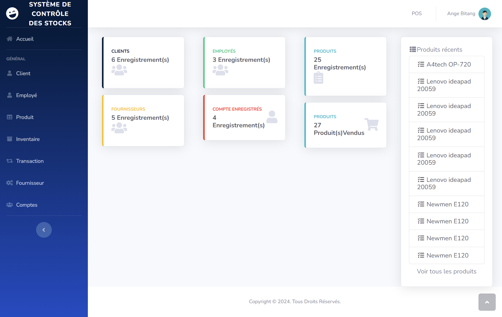

# Système de Gestion des Stocks
Ce système de gestion des stocks utilise une base de données MySQL et PHP. Cette application web offre une plateforme automatisée et en ligne pour les magasins ou d'autres entreprises. Les bons de commande, la réception, les commandes en attente, les retours et les enregistrements de ventes peuvent tous être gérés par ce projet pour l'entreprise. La bibliothèque Bootstrap et le modèle AdminLTE donnent à l'interface utilisateur de l'application une apparence agréable. De plus, ces fonctionnalités sont conviviales.

Il n'y a que deux types d'utilisateurs—Administrateurs Système et Personnel—qui ont accès à ce système de gestion des stocks. Les utilisateurs du personnel n'ont qu'un accès limité, tandis que l'utilisateur administrateur peut visualiser et gérer toutes les pages, formulaires et fonctionnalités de l'application web.

Chacun des enregistrements de stock du projet, y compris le Bon de Commande, la Réception, et d'autres, propose des fonctionnalités d'impression. En ce qui concerne le déroulement de ce projet, les utilisateurs administrateurs doivent d'abord remplir toutes les listes pertinentes, y compris la liste des fournisseurs et la liste des articles. Les utilisateurs peuvent ensuite générer un enregistrement de Bon de Commande Fournisseur.

Ils peuvent ensuite recevoir les articles listés sur chaque bon de commande, ce qui signifie qu'un enregistrement de BC est nécessaire pour ajouter le stock de l'article au système. Le système établira automatiquement un nouvel enregistrement de Commande en Attente pour les produits qui n'ont pas encore été livrés lorsque vous recevez les articles, si le fournisseur ne livre que certains d'entre eux ou pas du tout. Les enregistrements de CA fonctionnent de manière similaire aux enregistrements de BC.

La direction peut ensuite produire un enregistrement de retour lorsque les biens livrés présentent des défauts, des problèmes ou tout autre souci. Après avoir sauvegardé ce fichier, le système déduira immédiatement les biens endommagés de la disponibilité du stock. Enfin, l'enregistrement des ventes de l'entreprise est un enregistrement des stocks que ses clients ou consommateurs ont achetés. La disponibilité du stock sera également réduite pour chaque stock spécifié dans l'enregistrement des ventes.

#
# Système de Gestion des Stocks

#
